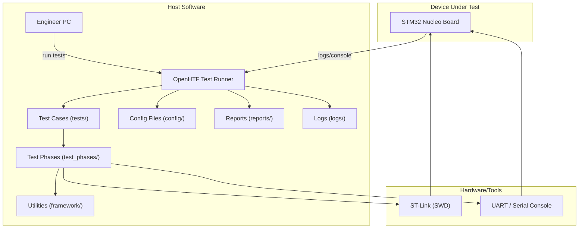

# Functional Test Framework

OpenHTF-based Hardware-in-the-Loop (HIL) functional testing framework for test and development cycles.

## 1 Overview

This framework provides automated functional testing on physical STM32 NucleoBoard hardware using OpenHTF. 
This can serve as a starting point for the development of a comprehensive test suite for validating firmware functionality, performance, and reliability on real devices during development and testing cycles.

## 2 Features

- **Hardware Abstraction**: plug-based architecture for STM32 STLINK programmer and serial console
- **Automated Testing**: Execute tests without manual intervention
- **Measurement & Validation**: Automatic PASS/FAIL with detailed measurements
- **Structured Reporting**: JSON test reports with execution data and measurements
- **Reusable Components**: Test phases and utilities for building  test scenarios

## 3 Architecture

This framework is built on top of **OpenHTF**. The key pattern is:

- **Test runner** executes **test cases**.
- A **test case** is composed of one or more **test phases**.
- **Test phases** use **hardware plugs** (for ST-Link, serial, etc.) and **utilities** to perform work.
- The runner reads **configuration** and writes **reports** + **logs**.

### Block Diagram (architecture)



### Folder layout (physical view)

```
tests/functional/
├── plugs/              # Equipment/Tools abstraction layer (programming, Command Line terminal access, CAN interface, Measurement tools, etc.)
├── test_phases/        # Input: Reusable test phase functions (e.g., program flash, verify firmware)
├── framework/          # Input: Utilities (copy scripts, helper scripts)
├── tests/              # Input: Test case implementations (the test procedures and execution logic)
├── config/             # Input: Configuration files (e.g., hardware settings, test parameters)
├── reports/            # Output: Generated test execution reports
└── logs/               # Output: Generated test execution logs
```

### Generated Artifacts (Not Version Controlled)

The following directories are automatically created by the setup script:

- **`reports/`**: Contains JSON test reports with detailed execution data, measurements, and pass/fail results. Each test run generates a timestamped report file.
- **`logs/`**: Contains execution logs from both the test runner and OpenHTF framework, useful for debugging test failures.

**Important**: These directories are intentionally excluded from Git (via `.gitignore`) because:
- Test reports and logs are not source code
- They can accumulate quickly with repeated test runs and consume significant disk space
- They contain equipment specific paths and timestamps
- They may include sensitive information (serial numbers, device identifiers)
- Recommended that each test environment should generate its own reports and later save for traceability and debugging purposes elsewhere.

## 4 Prerequisites

### Equipment and Hardware Tools Requirements

- **ST-Link Programmer**: V2 or V3 connected via SWD, for this demo you can use the onboard ST-Link on the NucleoBoard
- **USB-to-Serial Adapter**: For serial console monitoring, for this demo you can use the onboard STlink virtual COM port
- **Linux PC**: Test execution host (Ubuntu 20.04+ recommended), windows not tested yet but should work with minor adjustments

### Software Requirements

- **Python**: 3.8 or higher
- **STM32CubeProgrammer**: Version 2.19+ with CLI support, download from STMicroelectronics website
- **pip**: Python package manager

## 5 Installation

### Option A) setup script (recommended):

Install the required software and dependencies by running the one-step setup script:

```bash
cd tests/functional
./setup.sh
```

The script performs these steps automatically:
1. **Check Python 3** — confirms `python3` is available
2. **Create virtual environment** — creates `venv/` (skipped if it already exists)
3. **Activate virtual environment** — sources `venv/bin/activate`
4. **Upgrade pip** — ensures the latest pip is used
5. **Install Python dependencies** — runs `pip install -r requirements.txt` (openhtf, pyserial, pyyaml, …)
6. **Verify key packages** — imports openhtf, pyserial, pyyaml and prints their versions
7. **Create output directories** — creates `logs/` and `reports/` if they do not exist
8. **Check STM32CubeProgrammer CLI** — warns if `STM32_Programmer_CLI` is not found in PATH
9. **Smoke-test the runner** — runs `python3 run_tests.py --list` to confirm the framework loads

At the end, the script prints the available `run_tests.py` commands as a quick reference.

### Option B) Do it yourself manual setup

#### 1. Install STM32CubeProgrammer

Download and install STM32CubeProgrammer from STMicroelectronics website:
https://www.st.com/en/development-tools/stm32cubeprog.html

Ensure the CLI tool is in your PATH:
```bash
STM32_Programmer_CLI --version
```

#### 2. Create Python Virtual Environment (recommended)

```bash
cd tests/functional
python3 -m venv venv
source venv/bin/activate  # On Linux/Mac
# or
venv\Scripts\activate  # On Windows
```
---
#### 3. Install Python Dependencies using requirements.txt

```bash
pip install --upgrade pip
pip install -r requirements.txt
```
---
#### 4. Verify Installation

```bash
# Run verification script
./verify.sh

# Or manually verify
python3 run_tests.py --list
```

### Configure Hardware

Edit `config/hw_cfg.yaml` to match your setup:
- Set `serial.port` to your USB-to-serial device (e.g., `/dev/ttyUSB0`)
- Set `stlink.serial_number` if using multiple ST-Links (or leave as `null` for auto-detect)

## Usage

- List Available Tests

```bash
python3 run_tests.py --list
```

- Run All Tests

```bash
python3 run_tests.py
```

- Run Specific Test

```bash
python3 run_tests.py --test test_001_hello_world
```

- Run with Verbose Logging

```bash
python3 run_tests.py --verbose
```

- Custom Configuration

```bash
python3 run_tests.py --config config/custom_config.yaml
```
---
## 5 Hardware Setup

### Connect ST-Link

- Connect ST-Link to STM32 SWD pins or use onboard ST-Link on NucleoBoard
- Connect ST-Link to PC via USB
- Verify connection: `STM32_Programmer_CLI -c port=SWD -l`

### Connect Serial Console

- Connect USB-to-serial adapter to STM32 UART pins or use onboard virtual COM port
- Connect to PC via USB
- Verify port: `ls /dev/ttyUSB*` (Linux) or Device Manager (Windows)

### Power the Nucleo Board

- Provide power to STM32 board (via ST-Link or external supply)

---
## 6 Configuration

### Hardware Configuration (`config/hw_cfg.yaml`)

Defines hardware-specific settings:
- ST-Link programmer settings (serial number, interface, reset mode)
- Serial console settings (port, baudrate, timeout)
- Flash memory layout (addresses app, special banks)
- Optional: Power supply control

### Test Configuration (`config/test_cfg.yaml`)

Defines test execution parameters:
- Timeouts for operations (download, flash write, boot)
- Retry configuration (max attempts, delays)
- Performance thresholds (download speed, boot time)
- Test data paths
- Reporting options
- Debug settings

---
## 7 Framework Components

### Hardware Plugs

#### STLinkPlug (`plugs/stlink_plug.py`)
Provides methods to program firmware, read flash, and control reset using STM32CubeProgrammer CLI

#### SerialPlug (`plugs/serial_plug.py`)
Interfaces UART serial console for monitoring terminal logs and sending commands to the device

### Framework Utilities

#### src_draft_get.py

Copies the latest firmware binary from the build output directory to the test framework for use in testing.

---
## 8 Test Development

### Creating a New Test

1. Create test file in `tests/` directory (e.g., `test_00X_description.py`)
2. Import necessary plugs and utilities
3. Define test phases using `@htf.TestPhase()` decorator
4. Define measurements using `@htf.measures()` decorator
5. Create test using `htf.Test()` and add phases


### Test Phases

Test phases are reusable building blocks that:
- Perform specific operations (program, verify, monitor)
- Use hardware plugs for abstraction
- Make measurements with automatic validation
- Return pass/fail based on assertions

### Measurements

Measurements capture data with automatic validation, example:
```python
@htf.measures(
    htf.Measurement('download_time').less_than(60.0),
)
def verify_download(test):
    # Perform verification
    test.measurements.download_time = elapsed_time
```

## 9 Test Reports
Test execution generates JSON reports in `reports/` directory with details:

---
## 10 Troubleshooting

### STM32CubeProgrammer Connection Issues

```bash
# Check ST-Link connection
STM32_Programmer_CLI -c port=SWD -l

# Try with specific serial number
STM32_Programmer_CLI -c port=SWD sn=<serial_number>

# Check permissions (Linux)
sudo usermod -a -G dialout $USER
sudo udevadm control --reload-rules
```


### Test Timeouts

- Increase timeout values in `config/test_cfg.yaml`
- Verify firmware is running and manually with terminal

---
## 11 References

- **OpenHTF Documentation**: https://github.com/google/openhtf
- **STM32CubeProgrammer**: https://www.st.com/en/development-tools/stm32cubeprog.html
